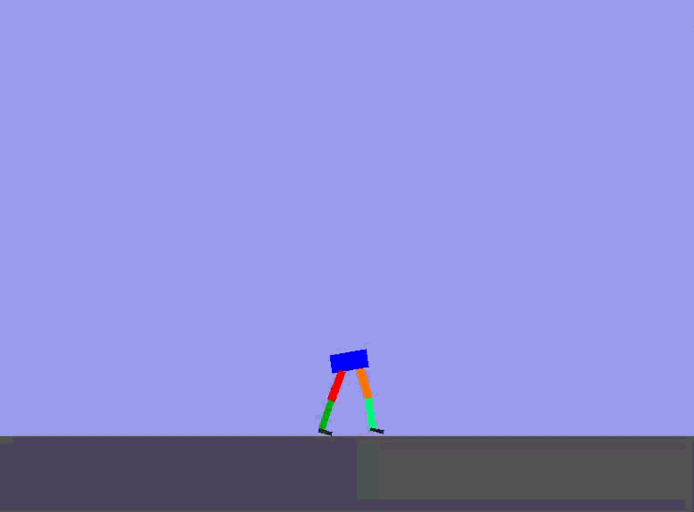

# RL Walker

<p align="center">
  
</p>

A reinforcement learning powered walking robot built with Python, Box2D and PPO.

## Overview

This project explores how a simulated robot can learn locomotion from scratch using reinforcement learning.

The robot is built in a custom Box2D environment and trained using PPO (Proximal Policy Optimization) from Stable-Baselines3.

Current development focuses on:

* Physics simulation
* Joint control
* Balance learning
* Biped locomotion
* PPO training

The long-term goal is a fully autonomous quadruped robot capable of learning stable and adaptive walking behaviors.

---

## Features

* Custom Gymnasium environment
* Box2D physics simulation
* PPO reinforcement learning
* Motorized hip and knee joints
* Joint limits
* Foot-ground interaction
* Real-time visualization with Pygame
* Manual control mode for debugging

---

## Current Status

- ✅ Custom Box2D environment
- ✅ PPO training
- ✅ Two legs with four controllable joints
- ✅ Real-time visualization
- ✅ Manual joint control (Self Play)
- 🚧 Walking in progress
- 🚧 Reward shaping
- 🚧 Terrain generation
- 🚧 Quadruped version

---

## Robot Structure

Current version:

* Torso
* Left upper leg
* Left lower leg
* Left foot
* Right upper leg
* Right lower leg
* Right foot

Actuators:

* Left hip
* Left knee
* Right hip
* Right knee

---

## Observation Space

The agent observes:

* Body position
* Body velocity
* Body angle
* Angular velocity
* Hip angles
* Hip velocities
* Knee angles
* Knee velocities

Total: 12 observations

---

## Action Space

Continuous control:

```text
[ left_hip,
  left_knee,
  right_hip,
  right_knee ]
```

Range:

```text
[-1.0, 1.0]
```

---

## Training

Algorithm:

* PPO (Stable-Baselines3)

Frameworks:

* Gymnasium
* Box2D
* NumPy
* Pygame

---

## Development Status

Current milestone:

✅ Stable physics

✅ Functional joints

✅ Functional feet

✅ Manual control testing

🔄 Learning first walking gait

⏳ Transition to quadruped robot

---

# Getting Started

## 1. Clone the repository

```bash
git clone https://github.com/ArtusIndus/Reinforcement-Learning-Walker.git
cd Walker
```

## 2. Install dependencies

```bash
pip install gymnasium
pip install stable-baselines3
pip install pygame
pip install box2d-py
pip install numpy
```

## 3. Train the robot

```bash
python train.py
```

The PPO model will be trained and saved automatically.

## 4. Watch the trained robot

```bash
python test.py
```

## 5. Manual control / Self Play

```bash
python selfplay.py
```

Control each joint manually with the keyboard to test the robot and experiment with different movements.

---

## Future Goals

* Robust biped walking
* Curriculum learning
* Procedural terrain
* Four-legged robot
* Recovery from disturbances
* Real-world robotics transfer
